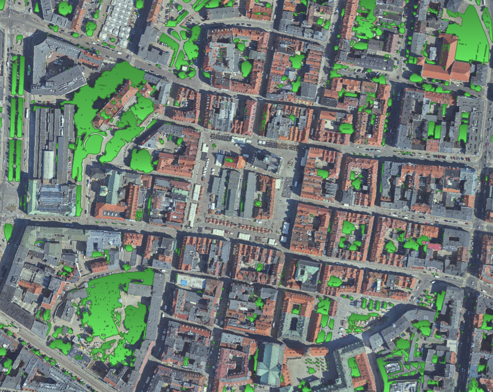

# ZPO Project - Segmentation of permeable and impermeable areas
This project presents a code responsible for training a unet segmentations model for detecting impermeable areas.

## Dataset
- trained on images provided by our lecturer and gathered by us with QGIS,
- 430 annotated images in total
- No preprocessing was added
- store the dataset with annotations in XXX and provide a link here
- what format for data and how to load it

## Training
- we used unet with with ressnet34 weights and following parameters:
```
EPOCHS = 3000
BATCH_SIZE = 32
T_MAX = EPOCHS * 344
learning_rate = 2e-4
```
- We used only vertical and horizontal flip for augmentations,
- in order to start training, you need to run main.py script,
- We used python 3.10.11, all requirements are in `requiremenets.txt`,
- remember to create `.env` file with content according to `.env.example`

## Results
- Example images from dataset (diverse), at least 4 images
- Examples of good and bad predictions, at least 4 images
- Metrics on the test and train dataset

## Trained model in ONNX ready for `Deepness` plugin
- model uploaded to XXX and a LINK_HERE
- model have to be in the ONNX format, including metadata required by `Deepness` plugin (spatial resolution, thresholds, ...)
- name of the script used to convert the model to ONNX and add the metadata to it

## Demo instructions and video
- a short video of running the model in Deepness (no need for audio), preferably converted to GIF
- We used read orthophotomap of Poznań. You can find it here

## People
- Krzysztof Nosal,
- Patryk Marczak

## Other information
Feel free to add other information here.