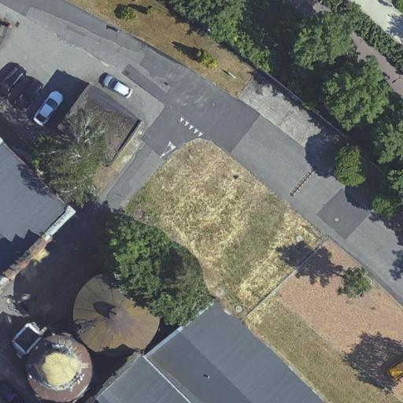
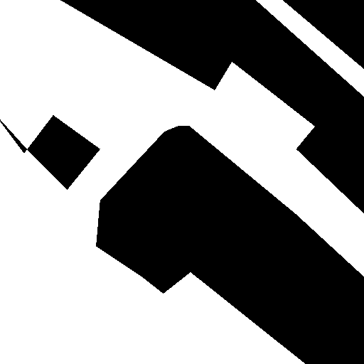
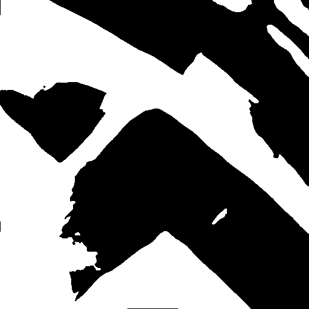
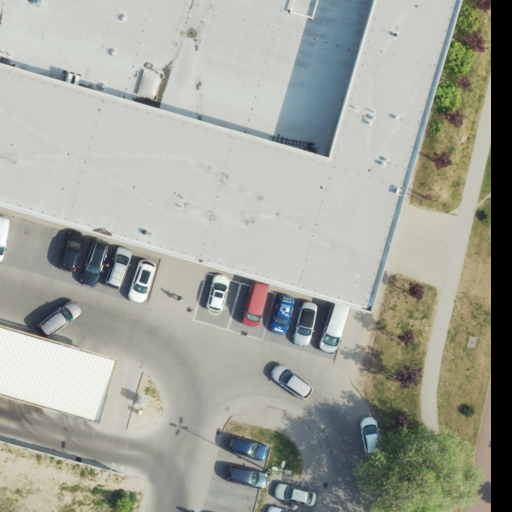
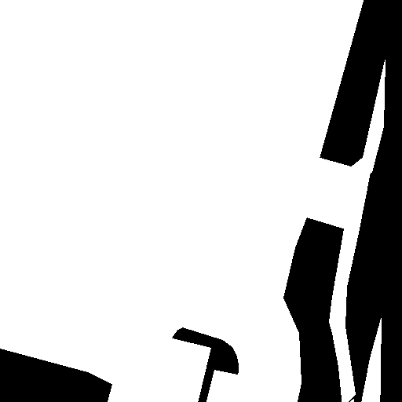
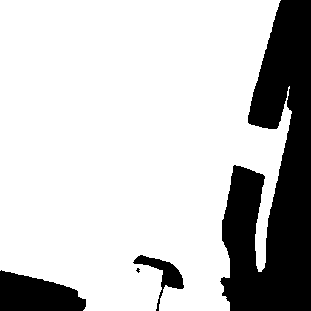
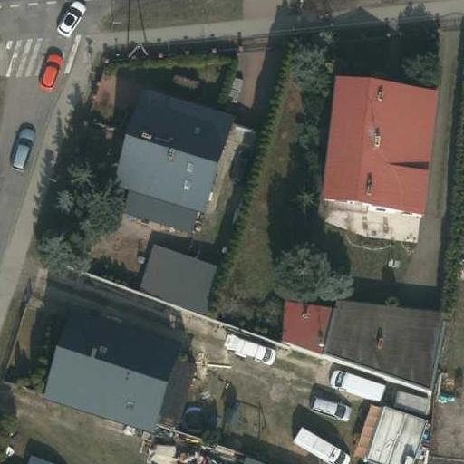
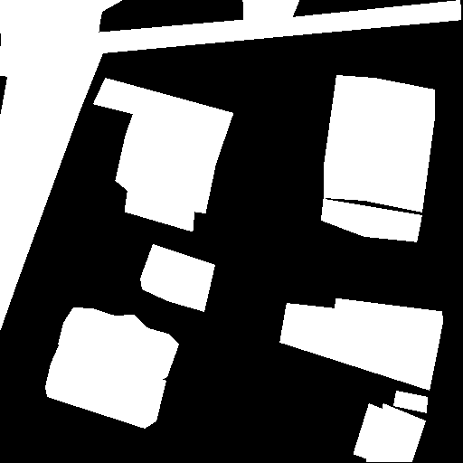
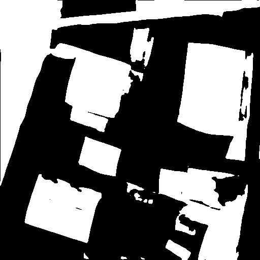

# ZPO Project - Segmentation of permeable and impermeable areas
This project presents a code responsible for training a unet segmentations model for detecting impermeable areas.

## Dataset
- trained on images provided by our lecturer and gathered by us with QGIS,
- 430 annotated images in total
- No preprocessing was added
- Links to datasets [Dataset1](https://drive.google.com/file/d/1ljnnWSF8dcQW_B2l2LCmRftnyGwotYba/view) [Dataset2](https://drive.google.com/file/d/1-Y9OTHWHCw8Gjus7c04yDKAPLKUpEgrq/view?fbclid=IwY2xjawIHbrdleHRuA2FlbQIxMAABHZA5QgUMeqGrJTDtK0tdnqeJcn0X3QgizQZpDTgbr3nv4avi5jE265_8dQ_aem_Qhj_ZKD1LhR5w386JcLscA) 

## Training
- we used unet with with ressnet34 weights and following parameters:
```
EPOCHS = 3000
BATCH_SIZE = 32
T_MAX = EPOCHS * 344
learning_rate = 2e-4
```
- We used only vertical and horizontal flip for augmentations,
- in order to start training, you need to run main.py script,
- We used python 3.10.11, all requirements are in `requiremenets.txt`,
- remember to create `.env` file with content according to `.env.example`

## Results

| Original | Mask | Prediction |
|----------|-------|-------------|
|  |  |  |
|  |  |  |
|  |  |  |

- Metrics we used to evaluate the model (training/metrics/epoch/valid/dataset_iou , training/metrics/epoch/valid/per_image_iou)

## Results in QGIS
| Original | Mask | Information |
|----------|-------|-------------|
|  |  |  |
|  |  |  |


## Trained model in ONNX ready for `Deepness` plugin
- Downloadable [model](https://drive.google.com/file/d/1wEOb0LlU485C1tyuDuCWIq7yiO5brLXB/view) 
- file used to convert the model to ONNX "file convert_to_onnx.py"

## Demo instructions and video
- a short video of running the model in Deepness (no need for audio), preferably converted to GIF
- We used read orthophotomap of Poznań. You can find it [hear](https://mapy.geoportal.gov.pl/imap/Imgp_2.html?SRS=2180&resources=map:wms@https://mapy.geoportal.gov.pl/wss/service/PZGIK/ORTO/WMS/TrueOrtho) 

## People
- Krzysztof Nosal,
- Patryk Marczak
